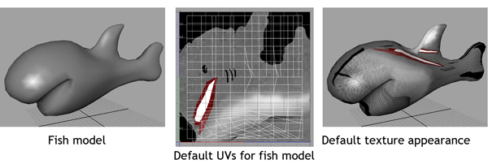
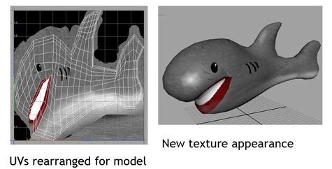
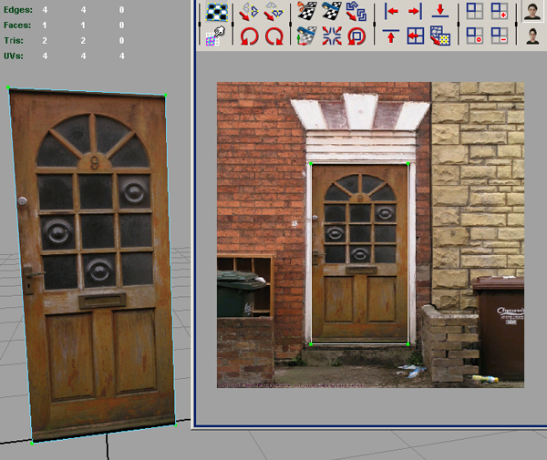
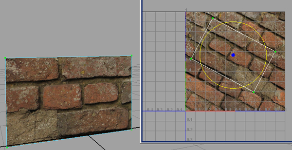
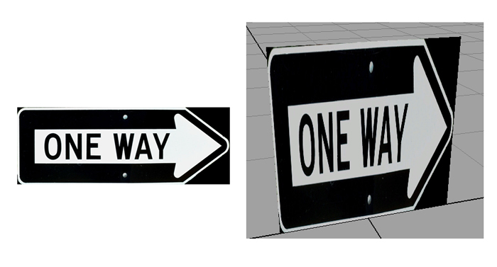
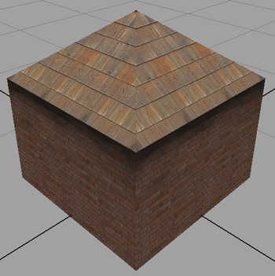
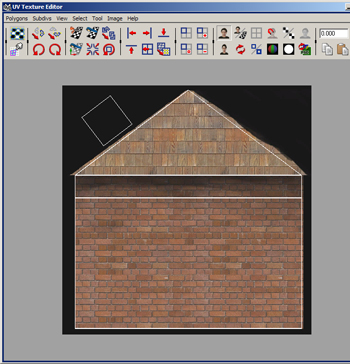
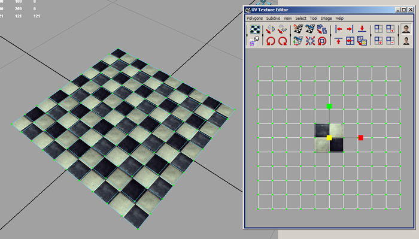
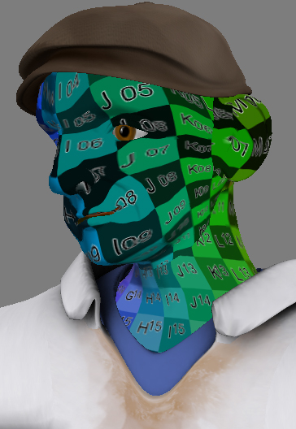

UV Mapping Theory -- Part 1
============================

By Joe Crawford, founder of Teaching3D.
Original article: [http://www.teaching3d.com](http://www.teaching3d.com)

See also:
- [[UV-Mapping-Theory--Part-2]] -- overlap, seams, islands, stretching, UV padding, projection methods
- [[UV-Mapping-Theory--Part-3]] -- pelt mapping, editing UVs, layouts, snapshots
- [[UV-Mapping-Theory--Part-4]] -- UV ranges, UDIMs, organizing textures

---

Understanding Mapping Coordinates
----------------------------------

Mapping coordinates, otherwise known as UV coordinates, determine where images
(maps) will show upon 3D geometry. UVs bridge the gap from the 3D world
(vertices) to the 2D world (pixels).

As discussed earlier, each vertex on an object has an X, Y, and Z location in
visible 3D space. To determine mapping coordinates, each vertex receives another
location in texture space -- meaning that each vertex receives a position
somewhere on a picture. This location in texture space is described by U, V,
and W coordinates (although W coordinates are rarely used since pictures are
almost always 2D).

By giving polygons UV coordinates we are essentially placing them in picture
space. If we have an image but only want to show one part of it on a polygon,
that polygon's UVs can be moved to that part of the picture.

UV coordinates are in 3D and can be rotated in any direction. Because of this,
the up direction in your images will not always be the up direction in 3D
software.

UV coordinates are normalized. Normalized means that the primary range is
between 0 and 1. At the left side of the image U=0, and at the right side U=1.
At the bottom V=0, and at the top V=1. This means that the top-left corner of
the picture is coordinate (0,1), and the very center of any picture is (0.5,
0.5).

Because UV coordinates are normalized, it makes no difference what resolution
the texture map is. Whatever picture you use will always be stretched or
squished into a 1x1 square. This is very useful because it means you can change
the resolution of your textures without changing the UV coordinates.

By utilizing UVs, objects can share different areas of the same texture.

Another interesting property of UV coordinates is that they loop continuously
outside the range of 0 to 1. Although the texture looks like it extends only to
its border, it actually tiles to infinity. For example, 0.3, 1.3, and 2.3 will
all return the same color from the picture; -0.7 and -1.7 will return the same
color as well. This means that by scaling vertices outward in UV space you can
cause your texture to repeat (tile). Shaders often contain a control to enable
or disable this repeating effect, for situations where you do not want the
texture to tile.

---

Utility Textures
-----------------

A utility texture helps you visualize the mapping coordinates on your model and
see how textures will conform to the geometry. In any situation requiring
complex mapping coordinates you should always use a utility texture. It will
help you find and correct stretching and seams. A good utility texture should
have colorization as well as readable coordinates in the texture itself. It
should also contain both sections of curvature and square sections.

As you can see, this head model definitely has some texture stretching. Problem
areas include the nose, chin, and the ears (to name a few).

No utility texture is ever perfect, and it is probably best to use a variety
for different situations. Sometimes people simply use a checker pattern for a
utility texture, but generally you want something that provides better feedback.
Good utility textures have colors, numbers, and different shapes such as
squares, circles, and text. Squares, circles, and text really help to visualize
whether or not UVs are stretching the texture.

---

*Continue reading in [[UV-Mapping-Theory--Part-2]]*
