UV Mapping Theory -- Part 2
============================

By Joe Crawford, founder of Teaching3D.
Original article: [http://www.teaching3d.com](http://www.teaching3d.com/)

*Continued from [[UV-Mapping-Theory--Part-1]]*

See also:
- [[UV-Mapping-Theory--Part-3]] -- pelt mapping, editing UVs, layouts, snapshots
- [[UV-Mapping-Theory--Part-4]] -- UV ranges, UDIMs, organizing textures

---

Texture Placement in Materials and Shaders
-------------------------------------------

Often, aspects of materials, shaders, and textures can contain information which
modifies the UV coordinates for a texture. For example, a texture can have a
repeat of UV values of 2,2 -- meaning that if the texture were assigned to a
square polygon that fit perfectly inside UV space (corners at 0,0 and 1,1), you
would see the texture repeat even though the UVs do not exceed the range of 0 to
1. The result would be a 2x2 tile: four instances of the texture on the object.

A cropping function may also exist in texture controls, so that UV space 0 to 1
only represents a section of the image, not the entire image. In this case the
UVs behave as if you cropped the image in an image editor and simply loaded a
smaller image as a texture.

Using placement controls in the material or texture is generally less useful than
editing the UV coordinates directly, because changes made in the material cannot
be applied per-object. It is also less standardized -- mapping coordinates work
the same way across different software packages, while material controls over
texture placement tend to be completely different from one package to another.

---

UV Sets and Channels
---------------------

UV sets allow you to have multiple UV coordinates per polygon. You can assign
or connect different textures to different UV sets on the same geometry.

In the following example, each texture uses different UV coordinates applied
to the same polygons, utilizing UV sets.

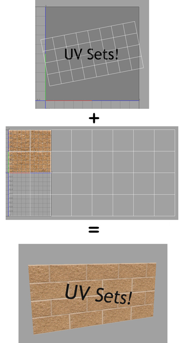

---

Important Definitions
----------------------

### Overlap

Overlap occurs when different parts of the geometry are placed over the top of
one another in UV space. This means that both sections will end up showing the
same part of the texture.

Overlap can be useful for saving texture memory, since different geometry can
share and repeat the same part of a texture. However, the disadvantage is
significant: **on two pieces of geometry that overlap in texture space, it is
impossible to paint the texture differently.** If you paint one section, the
other section will always match, because both reference the same area of the
texture.

Generally, when UV mapping, the first goal is to eliminate overlap and get all
sections of the model separated in UV space.

Baked lighting and normal maps are unlikely to work correctly with overlapping
UV coordinates, because these maps are generally unique to each object. Lighting
especially never repeats on objects.

In the example below notice how the single red dot shows up in two places on the
3D geometry. This UV layout makes it impossible to change the color of a single
dot.

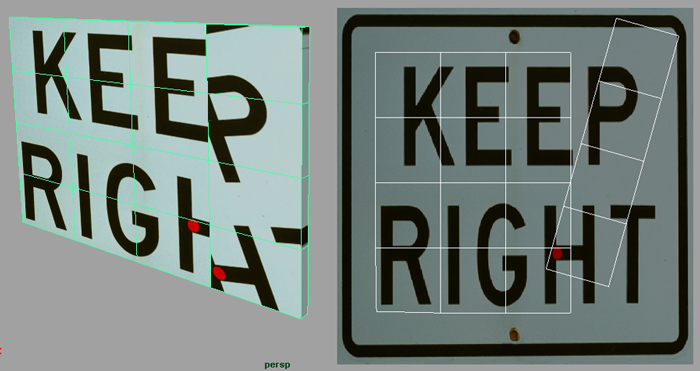

### Seams

This eight-polygon plane has had its UVs separated along its center, resulting
in a seam.

Even where geometry is continuous in 3D space it can be broken or split in UV
space. For example, each face on a cube can be separated from the others in UV
space -- all their vertices would be unmerged, and some edges would be open in
UV space.

An edge belonging to only one polygon in a given space can be considered open in
that space. Open edges in UV space are called **seams**.

A more intuitive example is the seams found on clothing. Clothing is created
from flat pieces of fabric; the places where the different flat sections join
together in 3D are called seams.

### Islands

The cylinder below has 3 islands contained within its UV layout.

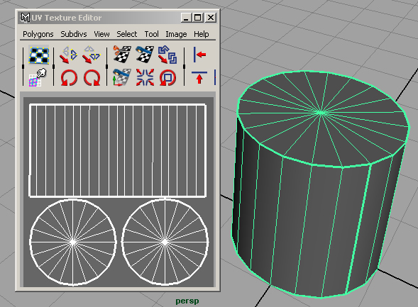

An island is a section of a model that is sewn together and not separated by any
seams. A UV island is the same concept as a polygon element, shell, or
continuous mesh, but in UV space. All polygons in a UV island are connected --
their vertices are welded or merged in UV space. Two polygons are part of the
same island if the edge between them is sewn, creating a "winged" edge in UV
space.

Just because UVs overlap does not mean they form parts of the same island.
In general, different islands should never overlap unless they will have
different materials or are on different UV sets/map channels.

Another way to think about an island is as a section whose topology is contained
entirely within the border of a UV seam.

### Stretching

Stretching occurs when the shape of polygons in 3D space differs from their
shape in UV space. As a common example, when an object has an even mesh density
but an unevenly spaced UV layout, the texture will stretch. Planar mapping on a
curved surface also causes texture stretching.

On most models (especially organic ones with complex curves), the only way to
completely eliminate stretching is to create seams around every polygon. Since
seams usually present problems, a balance between acceptable stretching and the
right number of seams must be found.

Sometimes stretching can be useful -- for example when dealing with non-square
textures. If the image used as a texture is not square, the UVs will generally
be squished to align with the non-square image.

The image below demonstrates texture stretching caused by the middle polygon
being small compared to the other two in texture space. Since the geometry mesh
density is evenly spaced, the UVs should also be evenly spaced to properly
display this texture.

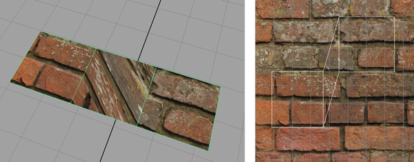

The image below shows a planar mapping result (from a camera projection). Notice
how the texture is stretched on the sides due to the UVs being compressed there.

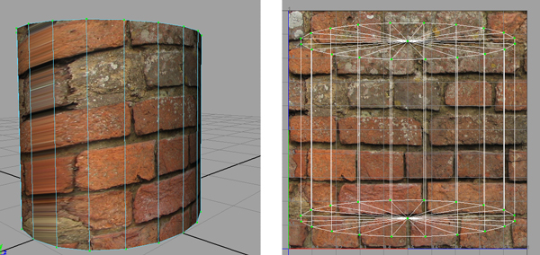

---

UV Padding
-----------

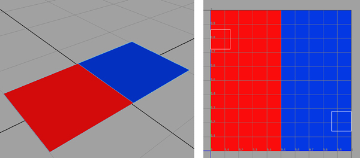

The two-polygon plane shown above has its UVs laid out very close to the
texture's edge. 3D software generally filters textures, which results in blurry
texture edges -- colors from one area bleed into adjacent areas. The image below
shows this clearly. Although it is important not to waste texture space, it is
equally important to leave padding between islands and texture edges.

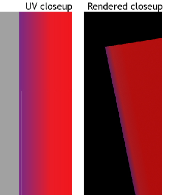

---

Ways of Generating UV Mapping
-------------------------------

### Projection Mapping

**Planar** -- UVs are projected onto the selected mesh along one axis, similar
to a slide projector shining light onto an object. This mapping method is mainly
used for flat surfaces. Note that it is known for stretching textures on surfaces
that are not flat (see the cylinder example above). This method is incorporated
into automatic mapping described below.

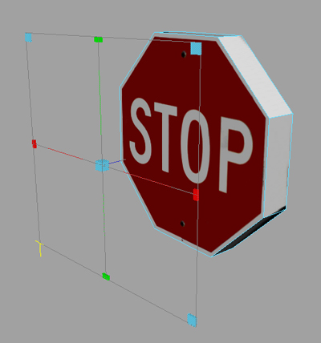

**Cylindrical** -- UVs are projected onto an object as if the image were rolled
into a tube and projected inward toward the object.

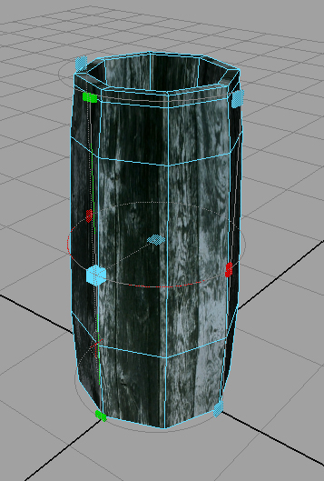

**Spherical** -- UVs are projected onto the surface from an imaginary sphere
that surrounds the surface.

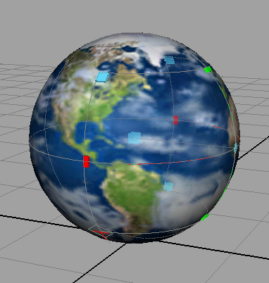

**Automatic / Flatten / Atlas** -- These systems take the normals of your mesh
into account and separate the result into many pieces, each laid out in UV space
without overlapping. Though often useful as a starting point, this sort of
mapping is far less "automatic" than it sounds. It takes a significant amount of
time to fix and turn into something usable. Default automatic mapping generally
has far too many seams to be useful, and a lot of stitching will be necessary.

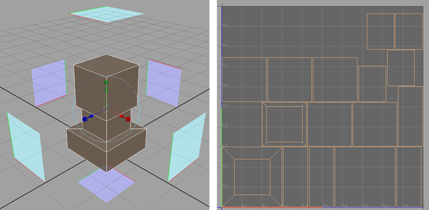

Applying any of the previous projection mapping techniques on a selection will
detach the UVs contained within the selection to their own island.

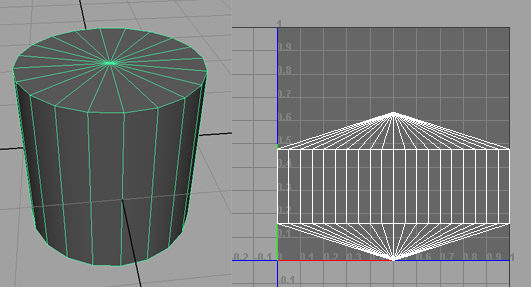

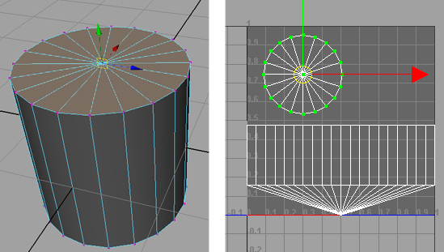

---

*Continue reading in [[UV-Mapping-Theory--Part-3]]*
