UV Mapping Theory -- Part 3
============================

By Joe Crawford, founder of Teaching3D.
Original article: [http://www.teaching3d.com](http://www.teaching3d.com/)

*Continued from [[UV-Mapping-Theory--Part-2]]*

See also:
- [[UV-Mapping-Theory--Part-4]] -- UV ranges, UDIMs, organizing textures


---


Creating Mapping Automatically by Marking Seams
-------------------------------------------------

Many software applications can automatically generate UV mapping when the artist
marks seams on the model. A few names given to these methods:

- Pelt Mapping
- Angle Based Flattening (e.g., ABF+ mapping in Blender)
- LSCM Mapping

**LSCM** stands for Least Square Conformal Mapping -- an advanced mathematical
method that automatically creates UV mapping while keeping texture stretch and
deformations minimal. The artist marks seams and the LSCM system determines the
mapping that produces the least stretching given those seams.

Notes on this approach:

- This is a modern and excellent method for generating UV coordinates quickly,
  even on highly complex objects. Some editing will usually be required
  afterwards, but it provides a massive head start over projection mapping.
- 3D Studio Max 8 includes pelt mapping.
- Many open source packages include pelt-style mapping systems. Wings 3D has an
  excellent pelt-based mapping system (highly recommended) -- it is free,
  open source, and works well alongside commercial packages. Blender also has
  an excellent system, though it is generally harder to learn than Wings 3D.
- The key to conceptualizing mapping on complex objects is to think of the
  object as cloth -- think the way a seamstress would. Many garments can serve
  as good examples of UV layout.
- Seams should generally be placed where they are least likely to be noticed:
  inside creases, wrinkles, or areas usually covered by other geometry.

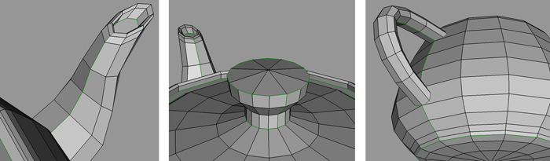

In the image above the green lines mark the seams placed by the artist. The
seams are torn and unfolded, shown in Wings 3D's UV editor below.

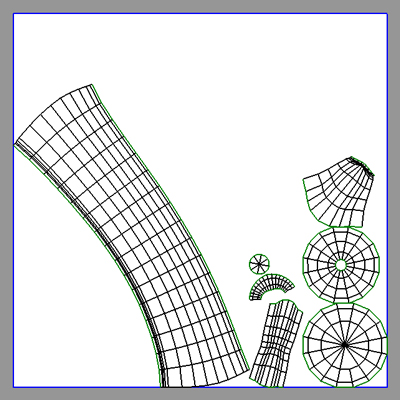

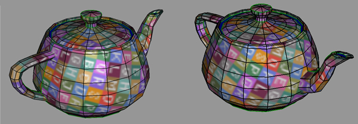

Look -- no stretching!


---


Editing UV Coordinates
-----------------------


### Cutting

In the example below, a face selection is converted to a UV selection. The
face's UV selection is then moved, demonstrating that the faces are connected.

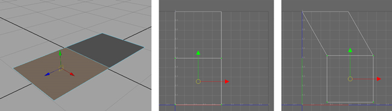

If you want to move the top face without affecting the bottom face, you must cut
the connected UVs to separate them. The example below shows the face's UVs
moved after executing a cut command on the connected UV selection.

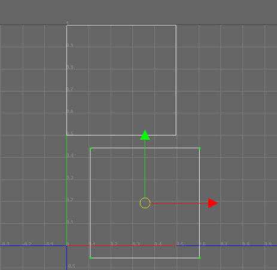


### Sewing

Notice the seam found on the piece of geometry below -- it is common to find a
seam that results from projection mapping that shouldn't be there.

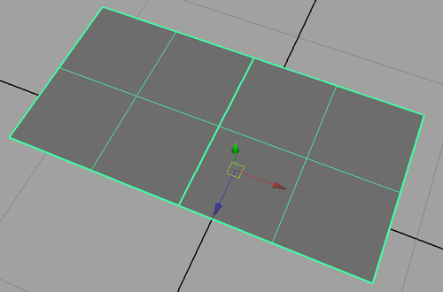

Selecting an edge that makes up a seam in the UV editor highlights the seam's
connecting edge. The majority of 3D software packages have a "Move and Sew"
command (Maya) or a "Stitch" command (3ds Max and Wings 3D). When a seam
selection is used with a move-and-sew command, the UV island snaps to the
corresponding island.

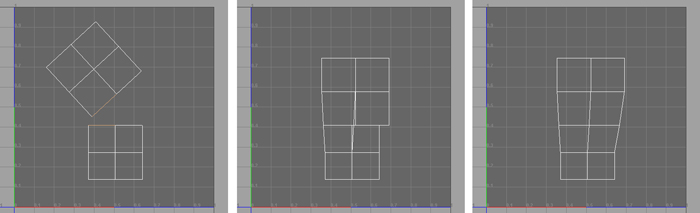


---


Layouts
--------

A proper UV layout wastes as little texture space as possible.

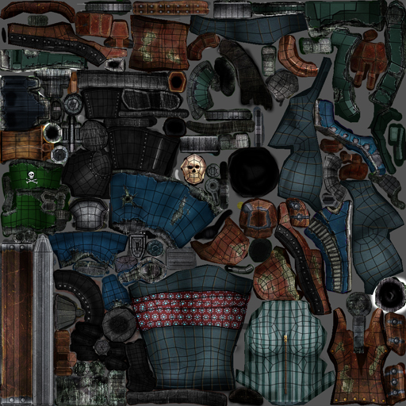

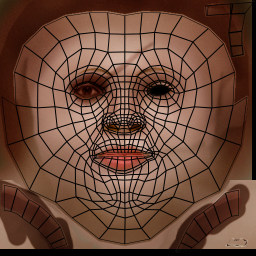

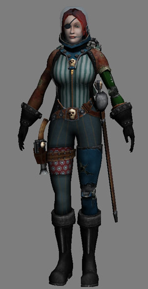

As you make good coordinates for everything, the sizing and layout will likely
be wrong at first. Decide what sizes things should be relative to each other,
based on how important each part of the map is going to be. Once you have scaled
the pieces to appropriate sizes, think carefully about the most efficient layout
-- how can the pieces fit together so that the least space is wasted? Look for
gaps in one piece that can be filled by another piece.

There may be a "Layout UVs" or "Pack UVs" tool to automatically place everything
inside the 0-to-1 UV range. Although these tools can provide a good starting
point, you can usually get much better results by thinking about it yourself and
laying them out manually. The computer is unlikely to know the relative
importance of each UV island. If you are in a hurry, use pack UVs; if you want
really good and efficient results, do it yourself.

The majority of the layout shown above was created using an Automatic/Flatten/
Atlas mapping command in conjunction with the move-and-sew technique. Some
parts were pelt mapped with the help of Wings 3D, such as the face, main body,
and jacket.

Utilizing an island (element) selection feature can speed up the process.
Results from a mapping technique such as projection mapping will sometimes
include isolated parts of the mesh due to placing their UVs into separate
islands.


### Snapshots

Once a UV layout is complete, 3D software packages include a UV snapshot
function which exports the UV layout as an image. Exporting your UVs allows
you to use them as guides when painting textures with 2D programs such as
Photoshop. PNG format works best for texture painting since it supports
transparency. The UV layout can then be placed on top of your painting as
a guide layer:

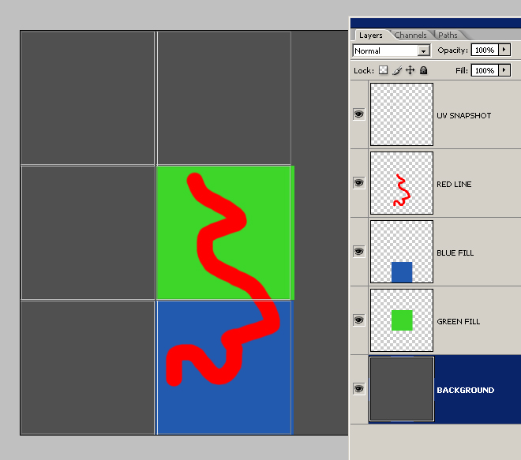

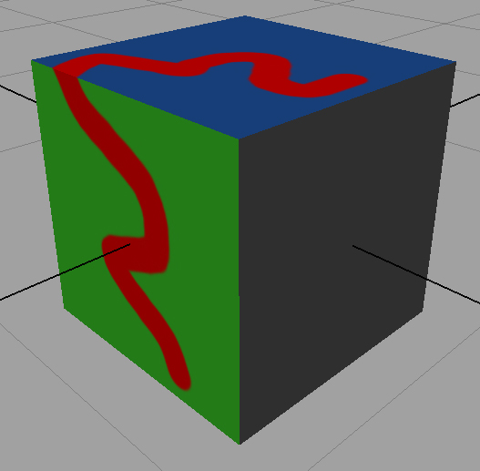


### Texture Map File Resolutions and Sizes

If editing UVs for a game model, the resolution of your texture must be in
powers of 2, such as 512x512. These sizes are also useful because some 3D
software shows display errors when using textures that are not square or are
not powers of two. This is particularly noticeable with cheaper video cards.

Powers of two used as texture sizes:

```
16, 32, 64, 128, 256, 512, 1024, 2048, 4096
```

Combinations are also commonly used -- for example 256x128 (wider than tall).
Test combination sizes with your hardware and target platform to confirm
compatibility.

Of the sizes in the list, all of the larger ones are common texture sizes in
games. The really small ones are not often used, but many games do use textures
as small as 32x32.

Each value is simply double the previous: 1, 2, 4, 8, 16, 32, ... and so on.


### General Concepts and Workflow Tips

- No mapping will ever be perfect on a complex object. Many objects will require
  either seams or stretching. Generally either too many seams or too much
  stretching will make the texture difficult to paint. A proper balance between
  the two needs to be found. Touch-up will usually be required afterwards --
  examples include painting over seams in a 3D painting program, or using a
  mapping coordinate blending method and baking the result to a map.

- See the ideal hand layout example on the Ninja model by Bobo The Seal:
  [http://www.bobotheseal.com/](http://www.bobotheseal.com/)

- Whenever possible, use image resolutions that are square and a power of 2.
  Video cards display these images more clearly, memory is organized more
  efficiently, UV space lines up to the image without distortion, and the art
  will more readily work in game engines.

  Examples: 16x16, 32x32, 64x64, 128x128, 256x256, 512x512, 1024x1024,
  2048x2048, 4096x4096


---


*Continue reading in [[UV-Mapping-Theory--Part-4]]*
