Understanding 3D Computer Graphics
====================================

Joe Crawford -- Founder of Teaching3D -- Available at [Teaching3D.com](http://www.teaching3d.com)

Published as a public Google Doc:
[https://docs.google.com/document/d/140uGk8TtGg-xaiHBQOvhzYQYThk0pNbEdkN6oqBWRGM/view](https://docs.google.com/document/d/140uGk8TtGg-xaiHBQOvhzYQYThk0pNbEdkN6oqBWRGM/view)


---


Theory of Polygon Modeling
===========================

In real life, objects are made of unimaginable numbers of atoms. Computers can't quite deal with such complex systems, so we need to use something simpler.

The simplest thing we can define on a computer is a point in space. (Similarly, if I had a piece of paper in front of me, the easiest thing I could draw on it would be a point, I'd just tap my pencil to the paper.) A point in space is called a vertex ("vert" for short). Several points are called vertices ("verts" for short). Coordinates are common attributes for a vertex. Coordinates are numbers which represent its position or point in space. For example:

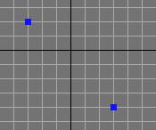

The image above is a screenshot from 3D Studio Max. Note that all 3D software has some sort of coordinate system. Coordinates are values based from the axis X, Y and Z. The center of 3D space, where coordinates are X=0, Y=0, Z=0, is called the "origin".

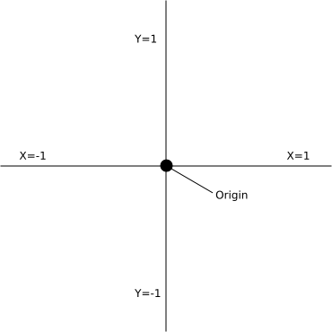

In general, points on a graph (a point is also called a "vertex") can have either positive or negative coordinate values.

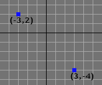

The vertex coordinates labeled above contain only two axis/dimensions (X,Y). For 3D space, consider the Z axis a pencil sticking straight out from your monitor, from the origin.

Now consider this: each point (or vertex) on the paper has a number (technical term: "vertex numbers"). We will call the first point I drew, Vertex 1. If I went ahead and drew more vertices, the second vertex I drew would be called Vertex 2 and the third would be called Vertex 3, and so forth.

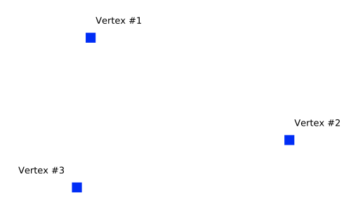

A bunch of points really don't do us much good on their own. So we will connect them, like a connect the dots game. Two connected vertices produces a line. A line connecting two vertices is called an "edge".

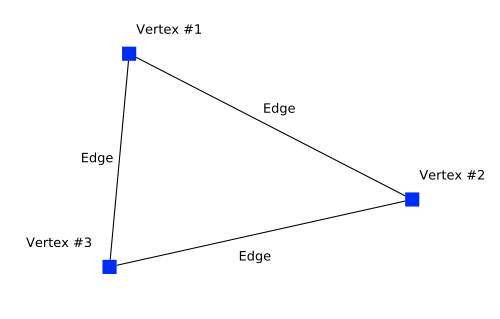

If we produce three edges by connecting the vertices, we'll get a triangle surface ("face"). A triangle is the simplest (and most efficient) surface we can create with vertices.

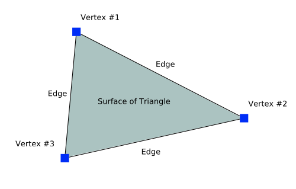

If we create additional triangles (extended from the first), we can create more complicated surfaces. Any surface can be created if we use enough triangles!


Triangles: The Simplest Surface
---------------------------------

Triangles are the simplest surface for computers to deal with. They have several properties which make this possible:

- They are made of straight lines. Triangles have no curves. Computers deal with straight lines well. They do not deal with curved lines easily. Think of it this way: if I gave you a piece of paper with two points on it and told you to draw a straight line between those two points, you'd know exactly what I meant. Everyone I gave that paper to would draw the same line. Now suppose I gave you that same piece of paper and told you to draw a curved, rounded line between the two points. Those are vague directions. You would be unsure of what exactly I wanted you to draw. Each person I gave that assignment to would draw slightly different curved lines. In order to make sure everyone drew identical curves between the two points I would need to give much more complicated directions.
- They are flat.
- They cannot self-intersect. Computers have a hard time handling intersections. So triangles are easier to deal with because it is impossible for them to go through themselves.

In the examples below, using 3D Studio Max and Maya, I've made two triangles and pulled the center connecting edge upwards, dividing the flat, or "planar" surface.

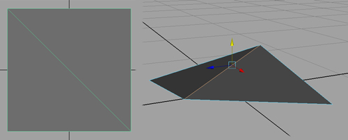

(Maya)

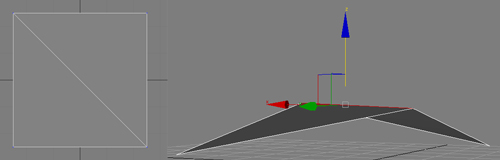

(3D Studio Max)

If two triangles are beside one another and seem to form one side of an object, or face of an object, we'll usually call them a polygon and deal with them as a polygon, as opposed to calling them two triangles. The polygon will still be made of two triangles, but we'll just call them a polygon to make it easier.


Polygons: The Next Simplest Surface
--------------------------------------

A polygon is like a triangle but has more sides. A square is a polygon. Any polygon can easily be broken down into triangles, so it is still quite simple. Polygons are usually flat, or close to being flat. If the two triangles form an extreme angle (are not flat) then we usually won't call them a polygon. The words 'polygon' or 'face' mean a group of triangles, one or more, separated only by invisible edges.

Polygons are often named differently depending on how many sides they have:

- tri - has 3 sides
- quad - has 4 sides
  - non-quad (any polygon that doesn't have exactly 4 sides)
- n-gon - has 5 sides or more

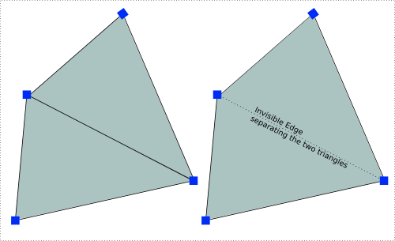

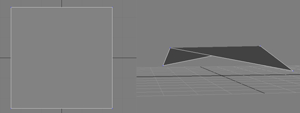

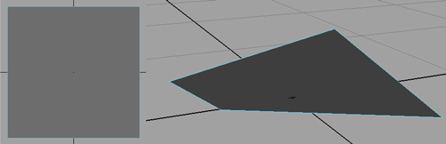

Many polygons together form what we call a polygon mesh. Ideally most polygons (faces) are **quads** (4 sided). Only rarely should other numbers of sides be used, such as ***tris*** (3 sided triangles) or ***n-gons*** (5 sided or more). ("Tris" is short for triangles, so in "tris" the "tri" should be pronounced like it is in "triangle".)

In the examples below, the objects are polygon meshes, collections of many connected polygons.


Concept of Face Normals
------------------------

Each triangle or polygon in 3D software has a "normal". If a polygon was perfectly flat, its normal would point straight up, away from the surface, always perpendicular. In order to simplify the amount of work the computer needs to do, 3D software can perform something called "backface culling". Cull meaning "to not show", "trim away", or "ignore" and backface means the back of faces or the back of polygons. "Backface culling" means not showing the back of polygons, only showing the front, or more accurately, the side the normal points from.

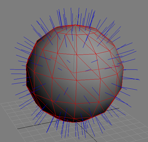

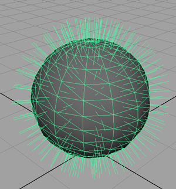

Example: Normals on a regular sphere point away from the center of the sphere. If you were standing outside of a giant sphere and you looked at it, you would be able to see it. If you were standing inside of it however, and backface culling was turned on, you would not be able to see it. Backface culling would eliminate the inside of the sphere because its normals do not face towards you.

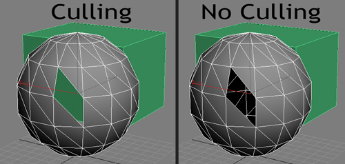

Be aware that you will often need to "flip", "reverse", or "invert" the normal. A command to do this is found somewhere in every respectable modeling package.

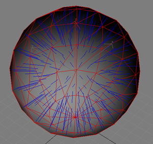

A practical use of flipping normals would be converting a sphere to an environment map dome. You could apply a sky texture to the sphere in the image above and place your outdoor scene within it.

> ***Note to author:*** mention vertex order calculating surface direction.


Concept of Vertex Normals
--------------------------

Vertex normals on smooth shaded objects average the face normals of their connecting faces and produce a vertex normal. (At least one vertex normal per vertex.) Vertex normals are extra information added to vertex data that is used for shading (and many other things). Similar to face normals, vertex normals can be user adjusted. Vertex normal angles can be adjusted to change the direction the vertex points, but rather than just being flipped one way or the other (inside vs outside), vertex normals can actually be rotated to point any direction the user likes.

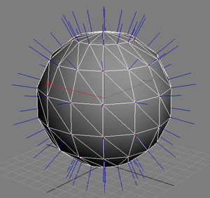

Modelers can use normals to their advantage when moving vertices. For example, you can move a vertex out on its normal for rounding the edge connecting the faces, or flattening a crease between two faces.

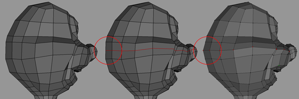

After splitting the polygons, the new edge loop does nothing to further define the character's form. Pulling the vertices out on their normals helps round him out.


Elements
---------

Also called a shell, face-shell, body, or continuous mesh.

An element is a surface of continuously connected faces. If two polygons are created side by side, each created out of different (unshared) vertices than the other, then they are considered to be different elements (not a continuous mesh). However, if the verts of the center edge between the two faces are shared by both faces, then they also share that edge between them, and we consider them part of the same element, or "shell". (Maya calls them *face shells*, 3ds Max calls them *elements*, and Blender calls them *linked faces*.)

Suppose we have two triangles, like in the image below. Since they are separated they are two elements -- we'll call them element A and element B. Now suppose we move them together so that they are touching. They are still considered to be two separate elements, even though they look like one. What separates them is that they are defined by different vertices. They do not share any vertices. In order to make them one element we would need to "merge" (or weld, or collapse, as it is sometimes referred to) the two vertices. At each place where the triangles seemed to touch one another, we would make sure there was only one vertex. Then the two triangles would share the vertices, and they would be one element. Usually, modeling software keeps your objects as one element most of the time, automatically sharing vertices when you extend the surface of your model.

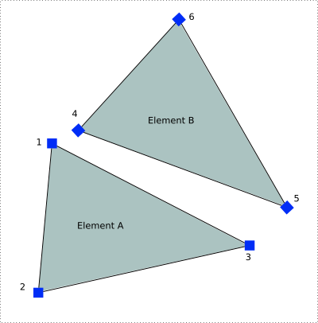

The above two triangles (A & B) are separate elements. None of the vertices are shared.

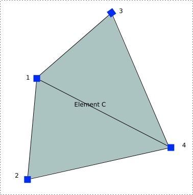

The above two triangles are one element (C) - they share vertices.

Polygons that are not connected to an element are not "continuous" with it.

> ***Note to author:*** screen grab of elements, like a face not connected.

Elements are useful in selecting groups of polygon objects where several distinct surfaces exist. In 3ds Max you can choose element mode when working with editable mesh/poly objects. In Maya you can select elements by extending/growing the selection as far as it will go.


Review -- The Components of Polygon Models
-------------------------------------------

### Vertex

A point, in a place. A vertex is perfectly small. It has no width, length or height attributes. A vertex by itself is practically useless unless you want to mark a position in 3D space. A vertex becomes a useful graphics component when it is connected to other vertices to make lines (edges) or surfaces.

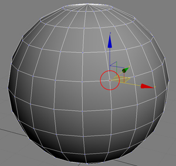


### Edge

One side of a polygon or triangle. If you move an edge, the two vertices that define that side of the polygon or triangle will really be moved.

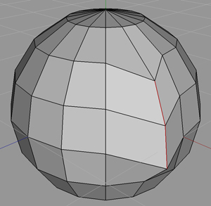


### Triangle

A triangle is defined by 3 vertices. Vertex 1, Vertex 2, and Vertex 3 make a triangle. That gives us a surface. The area inside the triangle's borders is also part of the triangle. The triangle is a surface. A triangle can be rendered, and would appear solid.

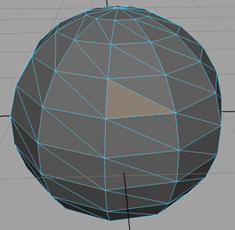


### Polygon (Face)

Polygons are like triangles but have more than three sides. Polygons are really made up of several triangles. Usually the software lets you deal with the polygons without having to worry about the triangles -- it worries about the triangles itself. You don't have to define each triangle separately. For some advanced modeling purposes you might one day need to worry about the individual triangle, but it is uncommon. A three sided polygon is a tri; a 4 sided polygon is a quad. Well constructed models should generally consist mostly of quads, with a few tris present. If the model is intended to be used for a subdivision surface (a way of rounding/smoothing models), it should not have polygons with more than 4 sides.

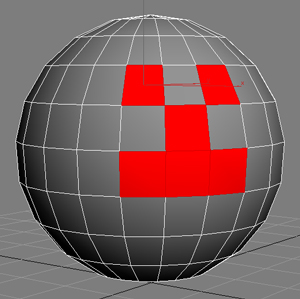


### Element (Shell, Body, or Continuous Mesh)

An element is a collection of polygons which are welded to each other. They share vertices with each other.

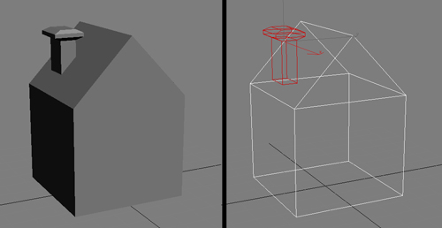


### Normals (Face Normals and Vertex Normals)

A normal tells the polygon which side is visible. When backface culling is turned on, you can only see a triangle if its normal faces you. Essentially, only one side of the triangle would be visible.


---


Fundamental Concepts of Objects
=================================


Hierarchy
----------

In order to make scenes easier to manage, we organize our scenes into hierarchies. This is often called "parenting" or "linking". A hierarchy is a collection of objects in which some objects are more important than others. Each object can be a parent, and can have child objects. If a parent object moves (or rotates or scales), its children will move with it. If a child moves, its parent will not move. Every object can have unlimited amounts of children, but may have only one parent. Parent objects can also have parents of their own. Objects that are children of other objects may have children of their own. It is very much like a family tree. The entire tree is called the hierarchy.

Example: Consider a book with a bookmark inside. When the book is moved, the bookmark follows the book because it is inside. When the bookmark is moved, the book is not affected -- the bookmark would probably just slide out of the book. The bookmark is a child of the book. The book is the parent of the bookmark.

Examples of creating hierarchies in software packages:

- Maya: With the bookmark selected, hold down the **Shift** key and select the book. The book will appear green. Press **P** on the keyboard to parent the bookmark to the book. The bookmark is now linked to the book.

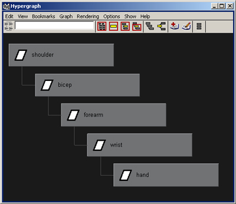

- 3ds Max: Select the bookmark. Click on the *Select and Link* tool. Click and drag from the bookmark to the book. Release the mouse button on top of the book. Both the book and its child bookmark should flash together to indicate the link they share.

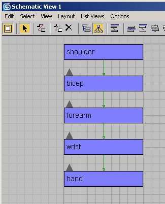

The majority of mainstream 3D software builds object hierarchies on a "child to parent" selection rule. As you can tell from the examples above, both 3ds Max and Maya conform to this rule of thumb. For example, if you had to link the bones of a hand to form a hand family/hierarchy, you would first select the tip of the finger (child) then select the finger's middle bone (parent) and link them. Using this method, you would work your way down from the finger tips and end up at the wrist bone.

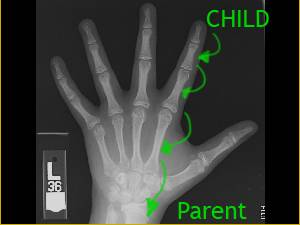

Note: All objects are considered to be children of the world if they don't have another parent. The world is by default the parent of all objects.


Pivot Points
-------------

Every object in a 3D environment has a pivot point. Simply put, the object rotates around its pivot point (e.g. a door around its hinge). Your hand, for example, rotates around your wrist. Your wrist is the hand's pivot point. Your lower arm rotates around your elbow. Your elbow is your forearm's pivot point. When objects rotate in real life, there is always a spot on the object that stays in place. A door rotates, but the hinges don't really move. The rest of the door moves around the hinge.

- Maya: Press **Insert**. You will be able to move the pivot point around. When finished, press **Insert** again to end the edit pivot point mode.
- 3ds Max: Go to the *Hierarchy* panel and turn on *Affect Pivot Only*. Use the regular move tool to move the pivot point around. Turn off *Affect Pivot Only* when you are finished.

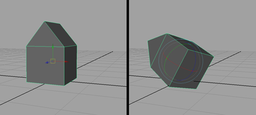

Default centered pivot.

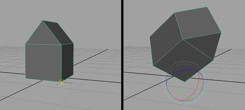

Pivot snapped to corner base.


Object Mode and Component Mode
--------------------------------

Most 3D applications have at least an *object mode* and a *component mode* (or sub-object mode).

*Object mode* means you are selecting and affecting entire objects.

*Component mode* means you are selecting and affecting parts of objects (e.g. verts, edges, faces).

In many software packages you are either in object mode -- editing the entire object as one -- or in component mode, where you make changes to the individual parts/components that form its shape. Different software uses different names for these modes.

The mode for working with parts of objects is called *component mode* in Maya, *sub-object mode* in 3ds Max, and *edit mode* in Blender. These terms all mean the same thing. It's just different terminology per software package. In this document I will use the word *component*, but the words are interchangeable.


Class
------

Objects in 3D animation software generally have a "class". The word class refers to a classification method. Since there are many kinds of objects in our scenes, the computer automatically categorizes them into different types. "Class" essentially means what type of object it is.

In a scene you could create different types of objects such as lights, cameras, geometry, or bones. One class of objects would be "Lights". Another class would be "Cameras". You can use classes to your advantage. For example, you could tell the software to only select objects in the "Light" class, letting you easily select a light in your scene without accidentally selecting surrounding objects.

Generally, your options will be different when working with each class. A light would have a setting for how bright you wanted it to be. A camera would probably not have a brightness setting, though it might have an 'exposure' setting instead.

Note that in Maya, most actual objects in the 3D scene are of class "transform". In Maya, other nodes -- usually called shape nodes -- are parented to the transform nodes, and the transform node is really what makes the shape node exist in a place in the 3D world. There are shape nodes for lights, cameras, polygons, etc. When you click a light to select it in the 3D view, it is the shape node that actually shows and gets clicked. However, the selected object will normally be the transform node that is the shape node's parent. To explicitly select the shape node, you could press the down arrow key on the keyboard, which would select the first immediate child -- normally the first shape node parented to that transform.

In Maya, joints are one of the rare exceptions to the above. Joints are a related type to transform nodes, so joints themselves don't usually need shape nodes. Joints will appear as visible objects in the scene even without shape nodes parented to them.


### Common Object Classes

- Geometry:
  - These are the objects that you can see. They have colors, surface detail and shading. They can look like objects in real life. Polygons and NURBS are both examples of geometry types.
- Curves/Splines:
  - Shapes in your scene. Usually not solid on their own -- no renderable thickness, for example. Essentially these are just lines used for other purposes, such as modeling references, creating objects, and animating other objects.
- Lights:
  - These objects cast light on your scene. They tell the computer how to shade the other objects. If your scene has dim lights it will likely appear dark. If your scene has many bright lights, your geometry will probably appear very light. Lights themselves do not render in most programs, so lights in your scene will be invisible in your final output. If you want a light bulb to appear in your scene, you would have to model it out of geometry.
- Cameras:
  - Camera objects provide a viewport for the audience and user. What the camera looks at can be seen in a camera viewport. The camera shows the scene as it would be framed in the final result, and the camera can be animated so that the viewport changes throughout the animation.
- Locators/Helpers:
  - These are invisible objects used to help you move and organize other objects more easily. Suppose you modeled a bunch of books sitting on the ground. You want to move them to another spot on the ground. You could create a locator, make it a parent of all the books (and bookmarks), and then drag the locator around to position the books. This would make moving the books easier.
  - Names for locators/helpers are application specific. For example:
    - Maya: Locator
    - Softimage/XSI: Null
    - 3ds Max: Point/Helper/Dummy
    - Blender: Empty


Transformation
---------------

Each object has something called a transform (or transformation). The object's transform tells it where to be, which way to point, and what size it should be. Move, rotate and scale are all parts of the transform. When you move an object in 3D software, the computer adjusts its transform.

Important: Move is also referred to as "translation", "location", and "position". Different apps use different words but they do the same things. Move and translate mean essentially the same thing in 3D animation programs. The three words move, position and translate are mostly interchangeable.

The software may list an object's transform in several different ways, but it always means the same thing.

You will usually have three numbers for position, three numbers for rotation and three numbers for scaling. For example:

```
Translation X = 0
Translation Y = 0
Translation Z = 0
Rotation X = 0
Rotation Y = 0
Rotation Z = 0
Scale X = 1
Scale Y = 1
Scale Z = 1
```

*(These particular values are known as the "identity" transform -- the default transform.)*

Sometimes you'll just see a transformation written as nine numbers:

```
0, 0, 0    <- position
0, 0, 0    <- rotation
1, 1, 1    <- scale
```

Usually, when you see three numbers side by side, the numbers correspond in order to: x, y, z. Often, three numbers together can instead correspond to r, g, b, such as in colors, where they mean red, green and blue.

To easily recall the order, remember this:

> "X, Y, Z, R, G, B, 1, 2, 3"
>
> Sounds like: "ex, why, zee, are, gee, bee, one, two, three"

By convention, in each row the first number means X, the second means Y, and the third means Z. Generally the order of the rows is Position, Rotation, Scale, though some software packages do break this rule.

Essentially, these nine numbers will tell the computer where the object is, which way it's pointing and how large it is.

Sometimes there are additional properties with numbers that form more complex transformations, but the above describes most basic situations. One example would be numbers for skew in xyz. In reality, computers store transformations as a math matrix, which is fairly complicated. Fortunately, most artists don't have to deal with the matrix directly.


Groups
-------

Groups can have very different meanings in different software packages.

Sometimes they are invisible objects which are parents of other objects, such as in Maya. Sometimes they are collections of things that can be selected and edited easily, and contain special properties like in XSI. Before using groups you should understand the fundamental concepts of how they work in the package you are using. In Maya, a group node itself is just an invisible transform node in the scene, one with no shape node as its immediate child. An empty group is just a transform node with no children at all.

Blender's version of a Maya group node would be Blender's object type called "empty".


---


Unorganized Content -- To Be Integrated
=========================================

> **Note:** The following content has not yet been worked into the sections above.

| Getting Technical: The transform is really telling you where the pivot point is (or where the local origin of the object is, since the pivot point itself might be offset in some apps). If the object's transformation tells you the object is 5 units above ground, it really means the object's pivot point is 5 units above the ground. If a sphere has a radius of 5 (diameter of 10) and a translation value of 5 units above ground, the object would be resting on the ground. You could move the sphere's pivot point and snap it to its lowest vertex. Then when you zero the Translate Y, the sphere would be resting precisely on the ground's surface. An object's transformation applies to the pivot point. The geometry/shape of the object follows the pivot point around. If you use the Insert key in Maya or the *Affect Pivot Point Only* mode in 3ds Max to move the pivot, you are really changing the transform value. The computer then automatically moves the geometry back to its original position to compensate. An object's geometry follows the pivot point around, unless you specifically try to move the pivot point separately. **Stuff to add:** Manifold Geometry - Double Faces, Lamina faces (faces sharing all edges but with reversed normal), Edges with no length, faces with no area. |
| :---- |
